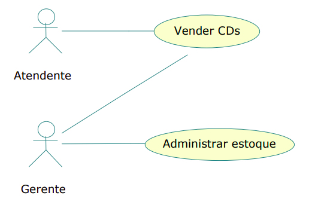

# Especificação de Requisitos (ERSw)

---

## Especificação de Requisitos

- Documenta os diferentes tipos de requisitos.
- O formato da documentação resultante da especificação de requisitos depende da organização, das necessidades do projeto e do ciclo de vida utilizado.
- Enunciado completo, claro e preciso dos requisitos de um produto de software.

---

# Conteúdo da ERSw

---

## Funcionalidade

- O que o produto deverá fazer?

---

## Interfaces Externas

- Como o produto interage com as pessoas, hardware do sistema e outros produtos?

---

## Desempenho

- Quais requisitos de velocidade de processamento.
- Tempo de resposta.
- E quais os demais parâmetros de desempenho?

---

## Outras Informações

- Que considerações devem ser observadas sobre:
- Portabilidade.
- Manutenibilidade.
- Confiabilidade?

---

## Restrições de Desenho

- Informa os padrões que o software deve seguir.
- Linguagem de implementação.
- Banco de dados.
- Ambiente de operação.
- Etc.

---

## Alteração de Requisitos

- Os requisitos podem sofrer alterações ao longo do tempo.
- Descoberta de defeitos e inadequações nos requisitos originais.
- Falta de detalhes suficientes.
- Alterações incontornáveis (Mudanças na legislação).

---

## Alteração de Requisitos

- Uma bom levantamento de requisitos **diminui** a necessidade de alteração.
- No entanto, deve ser possível alterar caso necessário.
- Deve manter o controle das alterações realizadas na especificação.

---

## Limites da ERSw

- Definir **correta** e **completamente** todos os requisitos.
- Não descrever aspectos gerenciais do projeto (custos, prazo, etc).

---

## Características da Especificação (Qualidade)

- **Correta**;
- **Precisa**;
- **Completa**;
- **Consistente**;
- **Priorizada**;
- Verificável;
- **Modificável**;
- Rastreável.

---

## Correta

- Todo requisito presente na especificação é realmente um requisito do produto.
- Solicitar aprovação formal por parte do cliente.

---

## Precisa

- Todo requisito presente possui apenas uma única interpretação.
- Essa interpretação é aceita tanto pelos desenvolvedores quanto pelos usuários.

---

## Completa

- Contém todos os requisitos significativos para o software.
- Funcionalidade, desempenho, restrições de desenho, interfaces externas.
- Define as entradas válidas e inválidas.
- Define a resposta do software para todas as entradas válidas e inválidas.
- Contém glossário de todos os termos técnicos.

---

## Consistente

- Não há conflitos entre requisitos.

**Exemplos:**

- Conflito lógico ou temporal entre ações.
- Uso de diferentes termos para designar o mesmo objeto.
- Etc.

---

## Priorizada

- Requisitos devem ser classificados quanto a estabilidade e importância.

**Essencial:** Sem ele o produto é inaceitável.
**Desejável:** Atendimento aumenta o valor do produto, mas ausência pode ser relevada caso necessário.
**Opcional:** Cumprido se houver disponibilidade de tempo e recursos.

---

## Verificável

**Requisitos verificáveis**

- Existe um processo finito, com custo compensador executado por pessoa ou máquina que mostre conformidade do produto final com o requisito.

**Requisitos não verificáveis**

- Requisitos ambiguos;
- Requisitos contrários a termos técnicos e científicos.

---

## Modificável

- Uma boa especificação de requisitos deve ser fácil de modificar.

**Para que isso seja possível, a especificação precisa ter algumas características:**

- **Bem organizada:** com índice, seções claras e referências entre partes relacionadas.
- **Sem repetição desnecessária:** evitar o mesmo requisito escrito em vários lugares.
- **Requisitos separados:** cada requisito deve estar descrito de forma independente, facilitando alterações pontuais.

---

## Rastreável

- Deve ser possível acompanhar a origem de cada requisito e também entender o que ele afeta no sistema.

**Rastreabilidade para trás**

- Qual foi a origem (cliente, usuário, lei, sistema, etc.).
- Por que ele existe.
- Quem ou o que pediu.

**Rastreabilidade para frente**

- Quais partes do sistema serão afetadas.
- Quais funcionalidades, módulos ou testes dependem dele.

---

## Estrutura Básica de uma ERSw

- Introdução;
- Descrição geral do produto;
- Requisitos específicos;
- Informação de suporte.

---

## Introdução

- Objetivo do documento
- Escopo do sistema
- Definições, acrônimos e abreviações
- Referências
- Visão geral do documento
- Histórico de versões

---

## Descrição Geral do Produto

- Perspectiva do produto
- Características dos usuários
- Ambiente operacional
- Restrições

---

## Requisitos Funcionais

- Casos de uso
- Fluxos (principal e alternativos)
- Entradas e saídas
- Regras de negócio

---

## Requisitos Não Funcionais

- Desempenho
- Segurança
- Usabilidade
- Disponibilidade
- Escalabilidade
- Manutenibilidade

---

## Interfaces

- Interface com usuário
- Interfaces externas
- Interfaces de hardware
- Interfaces de software

---

## Modelos e Diagramas

- Diagrama de casos de uso
- Diagrama de classes
- Diagrama de sequência
- Modelo de dados

---

## Apêndices

- Glossário
- Dicionário de dados
- Protótipos / wireframes

---

# Análise de Requisitos

---

## Análise de Requisitos

- Identificação dos atores;
- Identificação dos casos de uso;
- Identificação dos relacionamentos entre atores e casos de uso;
- Confecção do diagrama de casos de uso.
- Descrição dos cenários de casos de uso.

---

## Casos de Uso

- Representam funções completas do produto;
- É uma técnica de modelagem de requisitos;
- Descreve o que um sistema faz;
- Um caso de uso é um "documento narrativo que descreve a sequência de eventos de um ator que usa um sistema para completar um processo" (Ivan Jacobson).

---

## Casos de Uso

- Descrevem como os usuários interagem com o sistema (as funcionalidades do sistema);
- Dão uma visão externa do sistema;
- O conjunto de casos de uso deve ser capaz de comunicar a funcionalidade e o comportamento do sistema para o cliente;
- Descrevem o que o sistema faz, mas NÃO especificam como isso deve ser feito.

---

## Atores

- Modelam papéis dos usuários do produto;
- Modelam papéis e não pessoas: um ator pode modelar vários usuários físicos;
- Podem também modelar outros sistemas.

---

## Atores: Caracterização

- Descrição sucinta das responsabilidades do respectivo papel;
- Características mais importantes do respectivo grupo de usuários:
-- cargo ou função;
-- frequência de uso;
-- nível de instrução;
-- proficiência no processo de negócio;
-- proficiência em informática.

---

## Diagrama de Casos de Uso

---

## Descrição de Casos de Uso

### Nome do Caso de Uso

- Realizar Login.

### Escopo

- Sistema Web Acadêmico.

### Descrição do Propósito

- Este caso de uso tem como objetivo permitir que um usuário acesse o sistema por meio da autenticação utilizando login e senha válidos.

### Atores

- Os atores envolvidos neste caso de uso são o Usuário, responsável por informar as credenciais de acesso, e o Sistema de Autenticação, responsável por validar as informações fornecidas.

### Pré-condições

- Para que este caso de uso possa ser executado, o usuário deve estar previamente cadastrado no sistema, possuir login e senha válidos e o sistema deve estar disponível para acesso.

### Pós-condições

- Caso o processo seja realizado com sucesso, o usuário será autenticado, uma sessão será criada e o sistema redirecionará o usuário para a página inicial. Em caso de falha, o acesso ao sistema não será permitido e uma mensagem de erro será apresentada ao usuário.

### Fluxo de Eventos Normal

- O caso de uso inicia quando o usuário acessa a tela de login do sistema.
- Em seguida, o sistema exibe o formulário de autenticação contendo os campos de usuário e senha.
- O usuário informa suas credenciais e clica no botão “Entrar”.
- O sistema valida os dados fornecidos e verifica se as credenciais são válidas.
- Após a validação, o sistema autentica o usuário e redireciona para a página inicial do sistema.

### Fluxos de Eventos Alternativos

- Caso o usuário informe uma senha incorreta durante a validação das credenciais, o sistema exibirá uma mensagem informando que o usuário ou senha são inválidos e retornará para a tela de login para uma nova tentativa.
- Outra possibilidade ocorre quando o usuário esquece sua senha.
- Nesse caso, o usuário poderá selecionar a opção “Esqueci minha senha”.
- O sistema solicitará o e-mail cadastrado e, após o preenchimento, enviará instruções para recuperação da senha.

### Fluxos de Exceção

- Se ocorrer indisponibilidade do sistema durante o processo de autenticação, o sistema exibirá uma mensagem informando que o serviço está temporariamente indisponível e o processo de login será cancelado.
- Outra situação de exceção ocorre quando o usuário tenta realizar login sem preencher os campos obrigatórios.
- Nesse caso, o sistema exibirá mensagens solicitando o preenchimento correto das informações e permanecerá na tela de login aguardando a correção dos dados.

# Referências

- https://moodle.unesp.br/pluginfile.php/25934/mod_resource/content/1/diagrama_casos_uso.pdf

